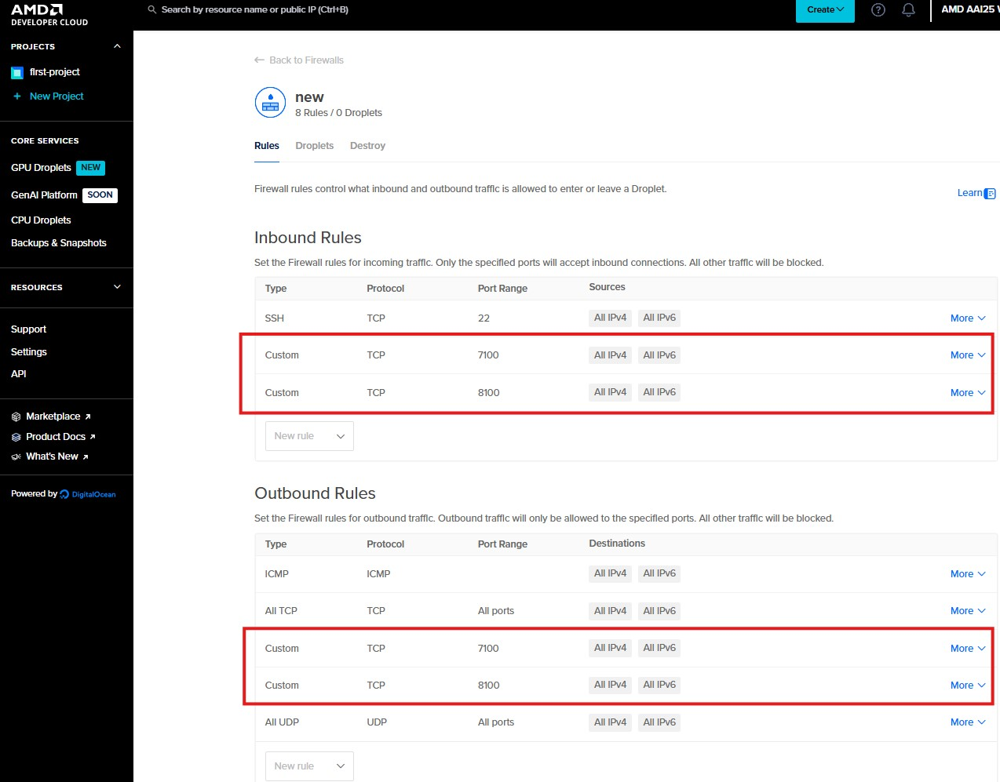

# Dev Cloud quick start
 
## ⭐

 - Click GPU Droplets

## ⭐

- Select AMD MI300X (1 GPU)
- Choose an image (ws201 needs to select ROCm SoftWare base image)
- Add your SSH public key and select your key
- Click "Create GPU Droplet"

## ⭐

- Please add TAGs with your name to easily identify your instance
- Check out SSH IP
- And Click "Networking" to add additional PORTs to the instance

## ⭐

- Open a terminal and access the instance IP along with PORTs to connect to the instance
- Check out GPU status
