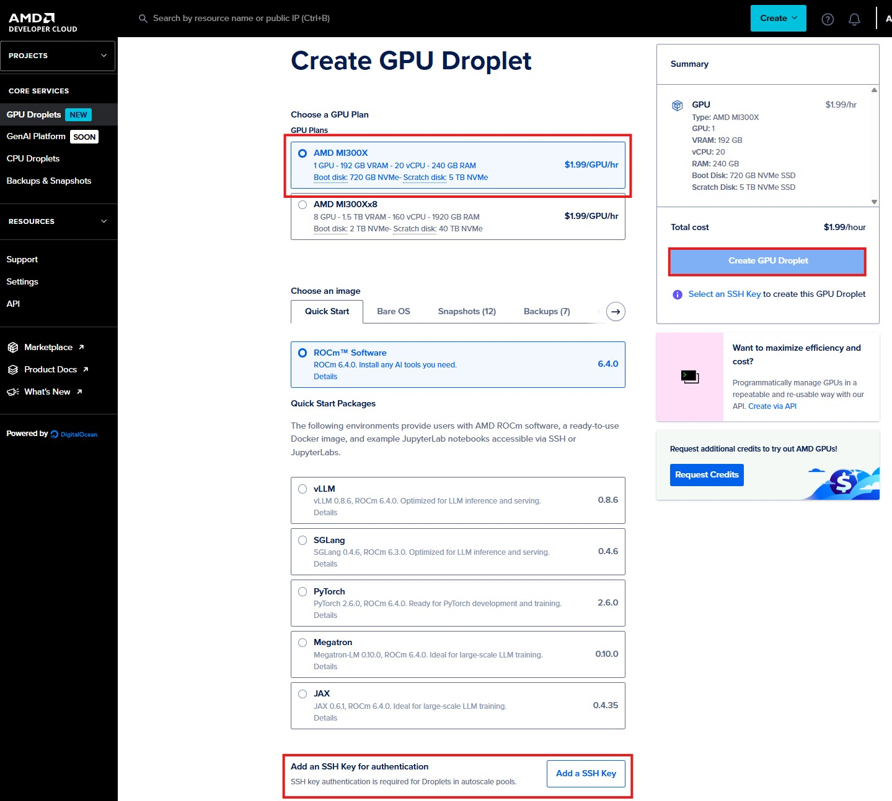

# Dev Cloud quick start

## ⭐ Step 1

 - Click GPU Droplets

## ⭐Step 2

- Select AMD MI300X (1 GPU)
- Choose an image (ws201 needs to select ROCm SoftWare base image)
- Add your SSH public key and select your key
- Click "Create GPU Droplet"

## ⭐Step 3

- Please add TAGs with your name to easily identify your instance
- Check out SSH IP
- (Optional) If you need to allow in/outbound PORTs, click "Networking" and register additional PORTs to the instance

## ⭐Step 4: Docker Launch
- Open a terminal and access the instance IP along with PORTs to connect to the instance

```sh
ssh root@YOUR_OP
```

- Check out GPU status by "rocm-smi"

Now navigate to [hackathon_start](https://github.com/seungrokj/ai_sprint_paris/tree/main/hackathon_guides/1_developing_vllm)
