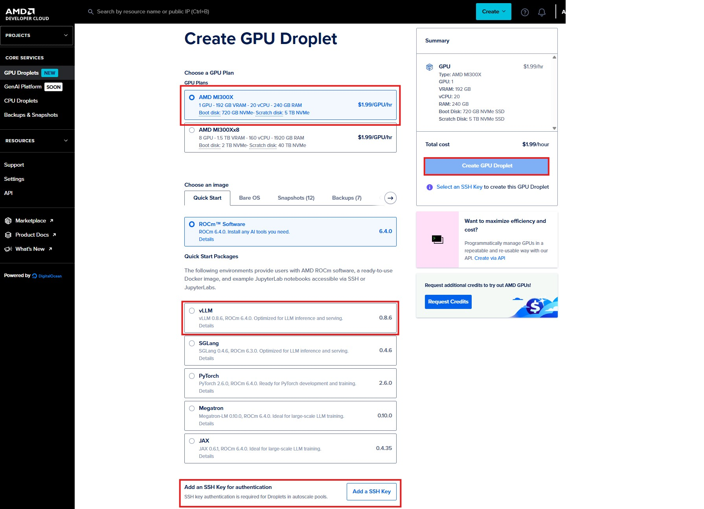
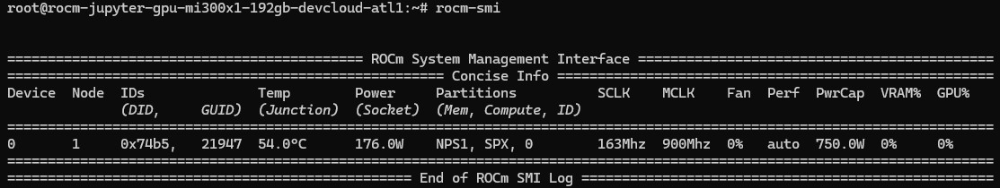

# Dev Cloud quick start

## ⭐ Step 1
- Click GPU Droplets

 
## ⭐Step 2
- Select AMD MI300X (1 GPU)
- Choose an image (vLLM image)
- Add your SSH public key and select your key
- Click "Create GPU Droplet"



## ⭐Step 3
- Please add TAGs with your name to easily identify your instance
- Check out SSH IP
- Networking: You can skip this (this is only for en/disabling additional in/out bound ports other than ssh 22 port) 


## ⭐Step 4: Docker Launch
- Open a terminal and access the instance IP along with PORTs to connect to the instance

```sh
ssh root@YOUR_OP
```
- Check out GPU status by "rocm-smi"
- 

Now navigate to [hackathon_start](https://github.com/seungrokj/ai_sprint_paris/tree/main/hackathon_guides/1_developing_vllm)
