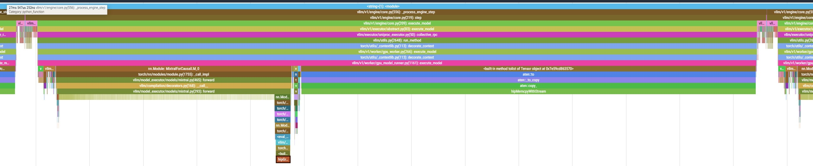
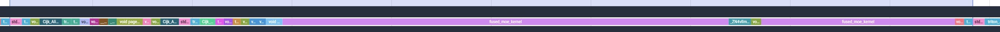

# Running vllm online serving benchmark

> [!NOTE]  
> Scripts referred throughout this guide are available at https://github.com/seungrokj/ai_sprint_paris/blob/main/scripts.

## First, remove the existing vLLM and reinstall the upstream vllm to the local folder in the container

First thing first, refer to the vllm local installation flow at [install local vllm](https://github.com/seungrokj/ai_sprint_paris/tree/main/hackathon_guides/1_developing_vllm)

Once you successfully installed the latest vllm, you can find you local vllm version is greater than **0.9.2**
```sh
root@7c35b3b04713:/workspace# pip list | grep vllm
vllm                                     0.9.2.dev321+g8fe7fc863.rocm641 /vllm-dev
```


## After vllm installation, attach an other terminal to the running container (1st terminal: server, 2nd terminal: client)

We recommend you to use multiple terminals (or termux, or equivalent) `ssh`ed into your MI300 VM.

Once logged into the VM and once vLLM container is started (previous step), you can run:

```bash
docker exec -it vllm-container /bin/bash
```

to log interactively into the running container in an other shell.

## Run vllm server & benchmarks (In the container)

Run `vllm serve` through our provided reference script to start the server that will be used for latency/throughput/accuracy evaluation:

Make sure you're at /workspace for running benchmarks

```sh
cd /workspace
```

```sh
./1_bench.sh server
```

### 1) Run performance benchmark (client)
```sh
./1_bench.sh perf
```

### 2) Run accuracy benchmark (client)
```sh
export HF_TOKEN=YOUR_HF_TOKEN
./1_bench.sh accuracy
```

## You will see these performance metrics

1. Performance

result_Jun26_10_34_48.json

| median_ttft_ms| median_tpot_ms| median_itl_ms| median_e2el_ms| total_token_throughput|
| --------------| --------------| -------------| --------------| ----------------------|

2. Accuracy (word_perplexity) Compare PPL against [Official PPL score](https://huggingface.co/amd/Mixtral-8x7B-Instruct-v0.1-FP8-KV#evaluation-scores)

| Tasks  |Version|Filter|n-shot|    Metric     |   |Value |   |Stderr|
|--------|------:|------|-----:|---------------|---|-----:|---|------|
|wikitext|      2|none  |     0|bits_per_byte  |↓  |0.5400|±  |   N/A|
|        |       |none  |     0|byte_perplexity|↓  |1.4540|±  |   N/A|
|        |       |none  |     0|word_perplexity|↓  |4.1378|±  |   N/A|

### 3) Run profiling

Run performance profile (client)

```sh
./1_bench.sh profile
```

### Visualizing the profiling trace

Profile dump is saved under `./profile/*.pt.trace.json.gz`, for example `./profile/09c1eb36108d_137.1750940187968632644.pt.trace.json.gz`.

In the terminal, scp the profile dump file to your local machine:

```sh
scp root@YOUR_IP:/workspace/profile/*.pt.trace.json.gz .
```

Open a profile visualization tool [Perfetto](https://ui.perfetto.dev/) in your web browser and load the trace there.

Then you will see CPU-side 1 token decoding activities during decode-only phase



Also, you will see GPU-side 1 layer out of 1 token decoding activities during decode-only phase: These are optimization target kernels



## Profiling individual kernels with ROCm Compute Profiler (omniperf)

Reference: https://rocm.docs.amd.com/projects/rocprofiler-compute/en/latest/

To display profile results, both a CLI and UI are available:
* https://rocm.docs.amd.com/projects/rocprofiler-compute/en/latest/how-to/analyze/cli.html
* https://rocm.docs.amd.com/projects/rocprofiler-compute/en/latest/how-to/analyze/standalone-gui.html

In case you'd like to use the UI, it might be easier to dump the profile data in your local computer.

TODO: test it again & share workflow

## Profiling with RocmProfileData

ROCm Profile Data is a collection of tools for tracing and analyzing gpu related activity on a system. This is represented by a timeline of api calls, app log messages, async gpu operations, and related interactions/dependencies.

References:
* https://rocm.blogs.amd.com/software-tools-optimization/kernel-analysis-deep/README.html
* https://github.com/ROCm/vllm/tree/main/benchmarks/profiling

TODO: test it & see if it is worth it, any difference with torch profiler?

## Profiling with ROCm Systems Profiler

Reference: https://rocm.docs.amd.com/projects/rocprofiler-systems/en/latest/index.html

TODO: test it and see if it is worth it to include here / any difference with torch profiler.
