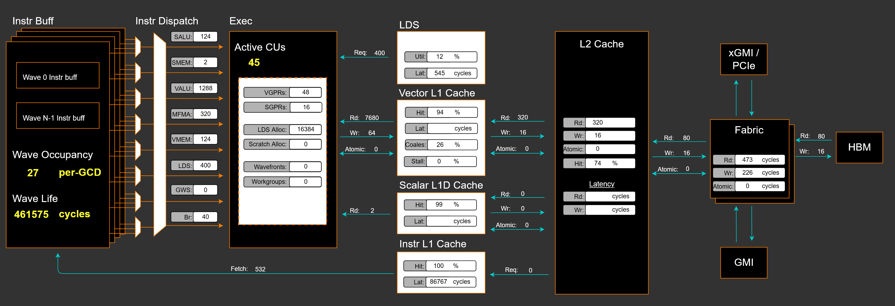
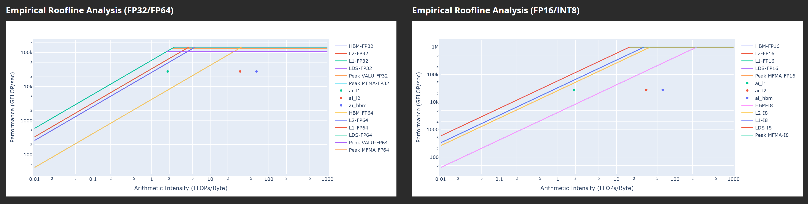
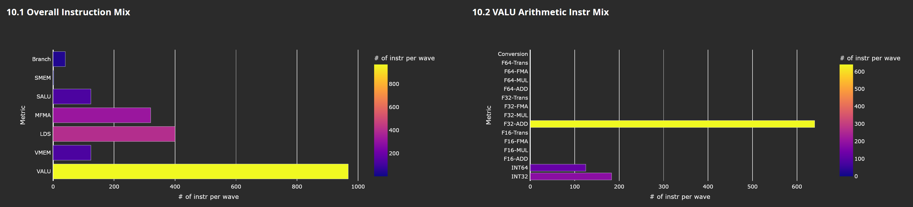
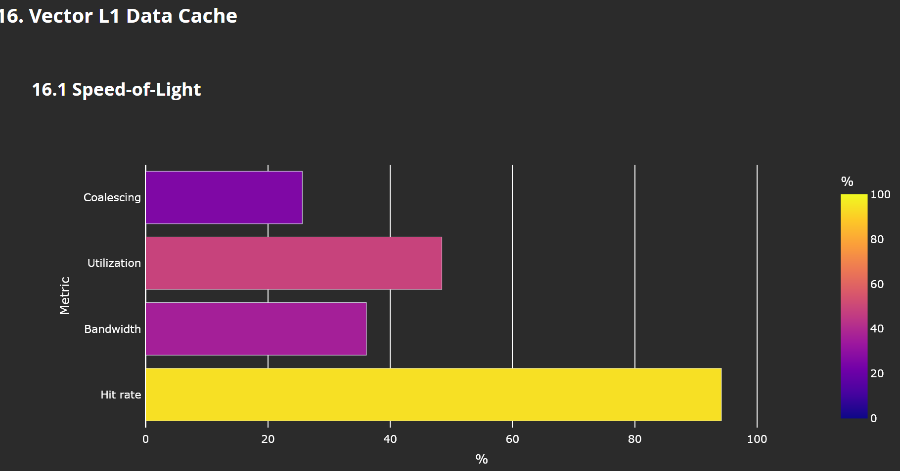

# Running vllm online serving benchmark

> [!NOTE]  
> Scripts referred throughout this guide are available at https://github.com/seungrokj/ai_sprint_paris/blob/main/scripts.

## First, remove the existing vLLM and reinstall the upstream vllm to the local folder in the container

First thing first, refer to the vllm local installation flow at [install local vllm](https://github.com/seungrokj/ai_sprint_paris/tree/main/hackathon_guides/1_developing_vllm)

Once you successfully installed the latest vllm, you can find you local vllm version is greater than **0.9.2**
```sh
root@7c35b3b04713:/workspace# pip list | grep vllm
vllm                                     0.9.2.dev321+g8fe7fc863.rocm641 /vllm-dev
```


## After vllm installation, open another terminal (1st terminal: server, 2nd terminal: client)

We recommend you to use multiple terminals (or termux, or equivalent) `ssh`ed into your MI300 VM.

Once logged into the VM and once vLLM container is started (previous step), you can run:

```bash
docker exec -it vllm-container /bin/bash
```
to log interactively into the running container in an other shell.

## Run vllm server & benchmarks (In the container)

Run `vllm serve` through our provided reference script to start the server that will be used for latency/throughput/accuracy evaluation:

Make sure you're at /workspace for running benchmarks

### 0) Launch vllm (server)
```sh
cd /workspace
./1_bench.sh server
```

### 1) Run performance benchmark (client)
```sh
./1_bench.sh perf
```

### 2) Run accuracy benchmark (client)
```sh
export HF_TOKEN=YOUR_HF_TOKEN
./1_bench.sh accuracy
```

## You will see these performance metrics

1. Performance

result_Jun26_10_34_48.json

| median_ttft_ms| median_tpot_ms| median_itl_ms| median_e2el_ms| total_token_throughput|
| --------------| --------------| -------------| --------------| ----------------------|
| 0| 0| 0| 0| 0|

2. Accuracy (word_perplexity) Compare PPL against [Official PPL score](https://huggingface.co/amd/Mixtral-8x7B-Instruct-v0.1-FP8-KV#evaluation-scores)

| Tasks  |Version|Filter|n-shot|    Metric     |   |Value |   |Stderr|
|--------|------:|------|-----:|---------------|---|-----:|---|------|
|wikitext|      2|none  |     0|bits_per_byte  |↓  |0.5400|±  |   N/A|
|        |       |none  |     0|byte_perplexity|↓  |1.4540|±  |   N/A|
|        |       |none  |     0|word_perplexity|↓  |4.1378|±  |   N/A|


### Submit to a leaderboard

If you want to see how your optimizations perform against other participants, we provide one more command.

```sh
export TEAM_NAME="your_team_name"
./1_bench.sh submit
```
This will submit run `perf` and `accuracy` benchmarks, show you the results and submit them to a leaderboard. The leaderboard is hosted 
as a Huggingface 🤗 space and is available at [https://huggingface.co/spaces/siro1/amd-leaderboard](https://huggingface.co/spaces/siro1/amd-leaderboard).

### 3) Run profiling (client)

```sh
./1_bench.sh profile
```

It can be useful to inspect the parameters in this profiling script to generate a smaller or larger trace, notably `OUTPUT_LENGTH` and `CONCURRENT` parameters. [PyTorch profiler](https://docs.pytorch.org/tutorials/recipes/recipes/profiler_recipe.html) may produce very large traces when profiling large models of with many run repetitions.

You also have the option to use the following Mixtral 8x7b FP8 model with only 2 layers, which is smaller to profile and will produce a smaller trace: https://huggingface.co/fxmarty/Mixtral-8x7B-Instruct-v0.1-FP8-KV-2-layers.

### Visualizing the profiling trace

Profile dump is saved under `./profile/*.pt.trace.json.gz`, for example `./profile/09c1eb36108d_137.1750940187968632644.pt.trace.json.gz`.

In the terminal, scp the profile dump file to your local machine:

```sh
scp root@YOUR_IP:/workspace/profile/*.pt.trace.json.gz .
```

Open a profile visualization tool [Perfetto](https://ui.perfetto.dev/) in your web browser and load the trace there.

Then you will see CPU-side 1 token decoding activities during decode-only phase


Also, you will see GPU-side 1 layer out of 1 token decoding activities during decode-only phase: These are optimization target kernels


## Profiling individual kernels with ROCm Compute Profiler (omniperf)

In case you are looking to optimize a specific HIP/Triton kernel (that e.g. you detected from a more high level profiler as PyTorch profiler), ROCm Compute Profiler is a good tool to use.

Reference: https://rocm.docs.amd.com/projects/rocprofiler-compute/en/latest/

Installation instructions are available [here](https://rocm.docs.amd.com/projects/rocprofiler-compute/en/latest/install/core-install.html). Specifically on DigitalOcean (AMD Dev Cloud) machines, you can install ROCm Compute Profiler with the following commands:

```bash
apt update
apt install -y rocprofiler-compute
apt remove -y python3-blinker
update-alternatives --install /usr/bin/rocprofiler-compute rocprof-compute /opt/rocm/bin/rocprof-compute 0
pip install -r /opt/rocm/libexec/rocprofiler-compute/requirements.txt
apt install -y locales && locale-gen en_US.UTF-8
pip install "dash>=3.0.0"

# Fix this bug in the latest package manager release: https://github.com/ROCm/rocprofiler-compute/issues/640
find /opt/rocm/libexec/rocprofiler-compute -type f -name '*.py' -exec sed -i 's/self.app.run_server/self.app.run/g' {} \;
find /opt/rocm/libexec/rocprofiler-compute -type f -name 'gui.py' -exec sed -i 's/\]\[0\]/\].iloc\[0\]/g' {} \;
```

Once installed, there are two steps:

1. Profile the kernel to collect metrics about the GPU usage.
2. Analyze the collected statistics, either through a [CLI](https://rocm.docs.amd.com/projects/rocprofiler-compute/en/latest/how-to/analyze/cli.html) or a [graphical UI](https://rocm.docs.amd.com/projects/rocprofiler-compute/en/latest/how-to/analyze/standalone-gui.html).

To profile, one can run:
```bash
CUDA_VISIBLE_DEVICES=0 ROCPROFCOMPUTE_LOGLEVEL=debug rocprofiler-compute profile --name your_name --device 0 --kernel sgemm_16x16x4 -- python  /repos/fp6_experiments/gemms_lib/test_gemm_v2.py
```

Parameters:

* `--name`: The name of the profile run, it will be saved under `workloads/name/MI300`.
* `--device`: Used to restrict the profiling e.g. on a single device.
* `--kernel`: Filter the profiled workload to collect statistics only from kernel(s) having a specific substring in their name. It is useful to pass a more complex script to `rocprofiler-compute` but still profile a single kernel.

To analyze results, one can run:
```bash
rocprofiler-compute analyze -p workloads/your_name/MI300/
```

This command displays profile results directly in the command line, you can see [an example of profile analysis here](https://github.com/seungrokj/ai_sprint_paris/blob/main/hackathon_guides/2_perf_accuracy_profile_vllm/assets/example_rocprof_compute_metrics.txt).


> [!TIP]
> The rocprofiler-compute's [performance model documentation](https://rocm.docs.amd.com/projects/rocprofiler-compute/en/latest/conceptual/performance-model.html) is very useful to understand these metrics.

In case you'd like to use the graphical UI, you can use: `rocprofiler-compute analyze -p workloads/your_name/MI300/ --gui`

To display the GUI in your web browser, you will need to [forward the port](https://www.ssh.com/academy/ssh/tunneling-example) used by rocprofiler-compute (usually `8050`) through an ssh connection:

```bash
ssh -L 127.0.0.1:8050:127.0.0.1:8050 yourname@ip
```

And go to http://127.0.0.1:8050 on your laptop to see the profiling UI, for example:










## Other available profilers

* [ROCm Systems Profiler](https://rocm.docs.amd.com/projects/rocprofiler-systems/en/latest/index.html): It is useful to profile complex workloads which involves multiple kernels, to get a global trace view. For vllm, it would be similar to pytorch profiler.
* [ROCprof Compute Viewer](https://github.com/ROCm/rocprof-compute-viewer): Released ~2 months ago, it gives a more detailed profiling view at the kernel level than rocprof-compute, notably at the assembly level. [Documentation here](https://rocm.docs.amd.com/projects/rocprof-compute-viewer/en/latest/).